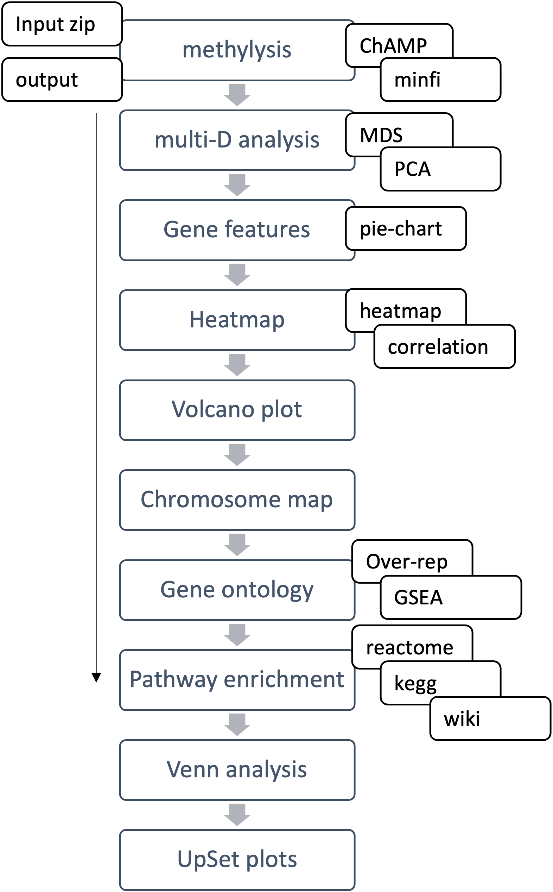

[](https://github.com/JD2112/methylr-devel/actions/workflows/docker-image.yml)
[](https://mybinder.org/v2/gh/JD2112/methylr/main?labpath=docs)
[](https://github.com/JD2112/methylr/actions/workflows/publish.yml)
[](https://sourceforge.net/projects/methylr/files/latest/download)
[](https://sourceforge.net/projects/methylr/files/latest/download)
[](https://sourceforge.net/projects/methylr/files/latest/download)

<!-- Begin SF Tag -->
<div class="sf-root" data-id="3543523" data-badge="oss-users-love-us-white" style="width:125px">
    <a href="https://sourceforge.net/projects/methylr/" target="_blank">methylr</a>
</div>
<script>(function () {var sc=document.createElement('script');sc.async=true;sc.src='https://b.sf-syn.com/badge_js?sf_id=3543523';var p=document.getElementsByTagName('script')[0];p.parentNode.insertBefore(sc, p);})();
</script>
<!-- End SF Tag -->

**IMPORTANT: MethylR web-server moved from methylr.research.liu.se to [https://methylr.serve.scilifelab.se/](https://methylr.serve.scilifelab.se/)**

# **methylr: a single shiny solution from sequencer data to pathway analysis**

- [Description](#description)
- [Diagram](#diagram)
- [Quick start](#quick-starte)
    - [test data](#test-data)
    - [local run](#local-use)
        - [requirements](#computational-requirements/compatibility)
        - [run command](#run-the-app)
- [Step-by-step guide](#step-by-step-guide)
- [Workflow summaries](#workflow-summaries)
    - [User input data preparation](#prepare-your-input-data-for-methylation-analysis)
    - [input dataset](#input-test-dataset)
    - [component tools](#component-tools)
- [Additional notes](#additional-notes)
- [HELP/FAQ/Troubleshooting](#helpfaqtroubleshooting)
- [License(s)](#licenses)
- [Acknowledgement](#acknowledgement)
- [Citation](#citation)
- [Credits](#credits)

## Description

Here we introduce *methylR*, a complete pipeline for the analysis of both 450K and EPIC Illumina arrays which not only offers data visualization and normalization but also provide additional features such as the annotation of the genomic features resulting from the analysis, pairwise comparisons of DMCs with different graphical representation plus functional and pathway enrichment as downstream analysis, all packed in a minimal, elegant and intuitive graphical user interface which brings the analysis of array DNA methylation data.


## Diagram



## Quick start

### Test data
1. All required test data except DNA methylation raw files, can be found [here](https://github.com/JD2112/methylr/tree/main/data) \
    i. **testDataFile1** - differentially methylated data file, can be used for gene features, Volcano plot, chromosome map, gene ontology and pathway enrichment analysis modules. \
    ii. **testDataFile2** - normalized beta value data table, can be used for MDS, PCA plots. PCA plot requires additional group data information, 'groupData'. \
    iii. **heatmapMatrix** - heatmap matrix test data file added in the testdata directory.

2. DNA methylation test data can be found [here](https://sourceforge.net/projects/methylr/files/testData.zip)

### Local use:
We provide Docker container for local use. Please note, the docker container was built on AMD64 OS architecture to get the full functional capabilities of Shiny/R.

### Computational requirements/compatibility (AMD64 only)
- **LinuxOS** - (AMD64)
    - *Ubuntu 20.04LTS* 
    - *Docker* (version 20.10.18)
    - *web-browser*: *Firefox* (version 105)
- **MacOS** - (Intel, AMD64 only)
    - *Monterey (version 12.5.1)* 
    - *Docker* (version 20.10.17)
    - *Docker Desktop* (version 4.12.0)
    - *web-browsers*: 
        - *Google Chrome* (version 106), 
        - *Firefox* (version 106), 
        - *Apple Safari* (version 15.6.1)
- **WindowsOS** - (AMD64)
    - *Windows 10* (version 21H2)
    - *Docker* (version 20.10.20)
    - *Docker Desktop* (version 4.13.0)
    - *WSL2* - (**Ubuntu 20.04LTS**)
    - web-browsers: 
        - Firefox (version 106), 
        - Google Chrome (version 107), 
        - Microsoft Edge (version 106).

**PLEASE NOTE: the ARM64 chipset architecture is actually not supported by *methylR*.**

### Run the app 

#### Linux AMD64 OS architecture
##### Step:1 - from terminal
```
# with docker container
docker run --rm -p 3838:3838 jd21/methylr:latest
```

##### Step:2 - web-browser
Open the web-browser (check above for your OS), and type:
```
http://localhost:3838
```

**For Singularity container**
Thanks to WiilieYu (https://github.com/JD2112/methylr/issues/3), we found a problem on running Singularity/Apptainer container on methylR and using a script from [sigularity-shiny](https://github.com/vsoch/singularity-shiny), we solved the issue. Please run the commands below for Singularity container (tested with Singularity v3.8.6) -

1. To run the [Singularity](https://docs.sylabs.io/guides/latest/user-guide/) or [Apptainer](https://apptainer.org/docs/user/main/index.html), please use the following commandlines -

```
# Copy prepare_template.sh to <YOUR_LOCAL_PATH> and run
/bin/bash prepare_template.sh start
```
The above command run will generate an script on the terminal and command to run on the server,

```
$ /bin/bash prepare_template.sh start
Generating shiny configuration...
port: 15910 # PLEASE NOTE THIS WILL BE CHANGED IN YOUR COMPUTER
logs: /tmp/shiny-server.ie3djR
base: /srv/shiny-server
run_as: jyotirmoy #<YOUR_USER_NAME>
Server logging will be in /tmp/shiny-server.ie3djR

To run your server:
    
    singularity run --bind /tmp/shiny-server.ie3djR/logs:/var/log/shiny \
    --bind /tmp/shiny-server.ie3djR/lib:/var/lib/shiny-server \
    --bind shiny-server.conf:/etc/shiny-server/shiny-server.conf <CONTAINER>

    ---------------------------------------------------------------------------
    For custom applications, also add --bind /srv/shiny-server:/srv/shiny-server
    To see your applications, open your browser to http://127.0.0.1:15910 or
    open a ssh connection from your computer to your cluster.
```

2. Run the following command on your server

```
singularity run --bind /tmp/shiny-server.ie3djR/logs:/var/log/shiny \
    --bind /tmp/shiny-server.ie3djR/lib:/var/lib/shiny-server \
    --bind shiny-server.conf:/etc/shiny-server/shiny-server.conf docker://jd21/methylr:latest
```

3. The terminal will prompt likes
```
INFO:    Using cached SIF image
INFO:    Converting SIF file to temporary sandbox...
[2023-07-31T06:44:52.258] [INFO] shiny-server - Shiny Server v1.5.18.979 (Node.js v12.22.6)
[2023-07-31T06:44:52.259] [INFO] shiny-server - Using config file "/etc/shiny-server/shiny-server.conf"
[2023-07-31T06:44:52.285] [INFO] shiny-server - Starting listener on http://[::]:15910
```

<Control>+click or run `localhost:15910` on the browser.


#### MacOS (Intel) and Windows AMD64 OS architecture
**Please follow the [manual](https://methylr.netlify.app/dockercontainer.html)**. 

## Step-by-step guide
Check the [manual for more details](https://methylr.netlify.app/intro.html). You can also find a complete PDF manual [here](MethylR-manual%20—%20DNA%20Methylation%20Data%20Analysis.pdf).

## Workflow summaries

### Prepare your input data for methylation analysis

*MethylR* module *mythylysis* requires a zipped file as the input dataset that contains Illumina IDAT files and a Sample_sheet as CSV format (See details in the [manual](https://methylr.netlify.app/methylysis.html)). To ease the task for the user, we provided a bash script (['createInputZip.sh'](createInputZip.sh)) to make the input zip file with IDAT and sample_sheet files (See details in the [manual](https://methylr.netlify.app/inputzip.html)). 

### Input test dataset

A test dataset from a previously published result ([GSE207426](https://www.ncbi.nlm.nih.gov/geo/query/acc.cgi?acc=GSE207426)) with RAW IDAT files for Illumina EPIC array can be found at [https://sourceforge.net/projects/methylr/](https://sourceforge.net/projects/methylr/). The test  dataset contains three samples in each group and the samples collected from solid tissue (will not work for 'Cell type heterogeneity'). More about the dataset can be found on the *[Methylome analysis for prediction of long and short-term survival in glioblastoma patients from the Nordic trial](https://www.frontiersin.org/articles/10.3389/fgene.2022.934519/abstract)* (Lysiak, M et al; 2022).

### Component tools
1. **methylysis**: [ChAMP](https://www.ncbi.nlm.nih.gov/pmc/articles/PMC3904520/); [minfi](https://academic.oup.com/bioinformatics/article/30/10/1363/267584?login=true)
2. **multi-D analysis**: [MDS](https://rdrr.io/bioc/minfi/man/mdsPlot.html); [PCA](https://rdrr.io/cran/FactoMineR/)
3. **gene feature analysis**: [plotly](https://plotly.com/r/); piechart
4. **heatmap analysis**: [heatmap.2](https://cran.r-project.org/web/packages/gplots/gplots.pdf); [d3heatmap](https://github.com/talgalili/d3heatmap)
5. **volcano plot**: [plotly](https://plotly.com/r/)
6. **chromosome map**: [chromPlot](https://bioconductor.org/packages/release/bioc/html/chromPlot.html)
7. **gene ontology**: [clusterProfiler](https://bioconductor.org/packages/release/bioc/html/clusterProfiler.html)
8. **pathway analysis**: [clusterProfiler](https://bioconductor.org/packages/release/bioc/html/clusterProfiler.html)
9. **venn analysis**: [Vennerable](https://github.com/js229/Vennerable); [intervene](https://intervene.shinyapps.io/intervene/)
10. **upset analysis**: [UpSetR](https://cran.r-project.org/web/packages/UpSetR/UpSetR.pdf); [intervene](https://intervene.shinyapps.io/intervene/)

## Additional notes
We provided an additional *python* script, *ChAMP2bed.py* for advanced users who want to visualize their DNA methylation results (from *ChAMP* workflow result) with additional annotation in [Integrative Genomics Viewer (IGV)](https://software.broadinstitute.org/software/igv/). Please check the [manual](https://methylr.netlify.app/bedscript.html) for more details.

## HELP/FAQ/Troubleshooting
Please check [the manual](https://methylr.netlify.app/intro.html) for details. 

For additional problems, check the [google group](https://groups.google.com/g/methylr) or contact the developer(mailto:methylr@googlegroups.com).

Please create [issues on github](https://github.com/JD2112/methylr-full/issues).

## License(s)
[GNU-3 public license - click to read details](https://www.gnu.org/licenses/gpl-3.0.en.html).

## Acknowledgement
We would like to acknowledge the **Core Facility, Faculty of Medicine and Health Sciences, Linköping University, Linköping, Sweden** and **Clinical Genomics Linköping, Science for Life Laboratory, Sweden** for their support.

## Citation

Massimiliano Volpe, Jyotirmoy Das, methylR: a graphical interface for comprehensive DNA methylation array data analysis, Bioinformatics, Volume 39, Issue 4, April 2023, btad184, https://doi.org/10.1093/bioinformatics/btad184

[View the article](https://academic.oup.com/bioinformatics/article/39/4/btad184/7114023)

## Credits
Massimiliano Volpe, Jyotirmoy Das
